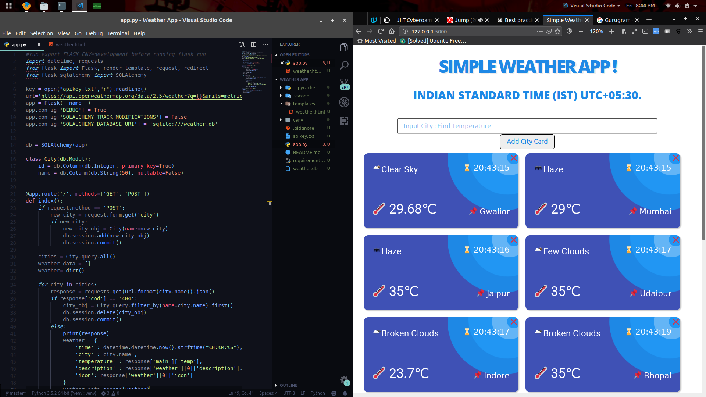

# Simple Weather App

> Implemented in Flask,Python3

[![License][license-image]][license-url]

I used weather data from Open Weather Map API

## Usage example

This application is really simple to use. Like any Flask **app**, you must start it like so:

```bash
export FLASK_ENV=development
flask run
```



## Meta

Mayank Singh – [@code-monk08](https://twitter.com/codemonk08_) – mayank.singh081997@gmail.com

Distributed under the MIT license. See ``LICENSE`` for more information.

[license-image]:https://img.shields.io/badge/license-MIT-blue.svg
[license-url]:https://raw.githubusercontent.com/clamytoe/pyTrack/master/LICENSE
