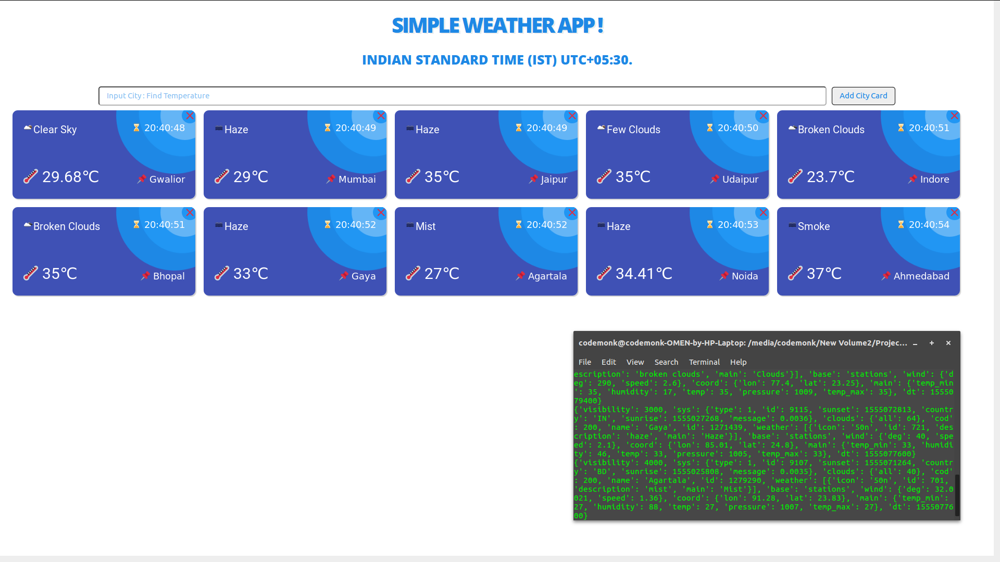

<p align="center">
  
</p>

[](https://github.com/code-monk08/simple-weather-app/issues)  [](https://github.com/code-monk08/simple-weather-app/network/members)  [](https://github.com/code-monk08/simple-weather-app/stargazers)          [](https://twitter.com/intent/follow?screen_name=codemonk08_)  [](https://telegram.me/codemonk08)

## :ledger: Index

- [About](#beginner-about)
- [Usage](#zap-usage)
  - [Installation](#electric_plug-installation)
  - [Commands](#package-commands)
- [File Structure](#file_folder-file-structure)
- [Guideline](#exclamation-guideline)  
- [Resources](#page_facing_up-resources)
- [Gallery](#camera-gallery)
- [Credit/Acknowledgment](#star2-creditacknowledgment)
- [License](#lock-license)

##  :beginner: About

Implemented in Flask, Python3, It is a basic CRUD application which supports searching for cities worldwide and adding them as css cards showing their temperature and other details, It also supports deleting the cards.

## :zap: Usage
To use this project.

###  :electric_plug: Installation
- Install dependencies & export environment variables.

```bash
$ sudo -H pip3 install -r requirements.txt
$ export FLASK_APP=app.py
```
###  :package: Commands
- Start project using
```bash
$ flask run
```

##  :file_folder: File Structure
- Add a file structure here with the basic details about files, below is an example.

```
.
├── apikey.txt
├── app.py
├── _config.yml
├── images
│   ├── logo
│   │   └── logo.png
│   └── screenshots
│       ├── 1.png
│       └── 2.png
├── LICENSE
├── README.md
├── requirements.txt
└── templates
    ├── a.css
    └── weather.html

4 directories, 11 files
```

| No | File Name | Details 
|----|------------|-------|
| 1  | apikey.txt | contains API key obtained from Open Weather Map
| 2  | app.py | contains logic for simple weather application
| 3  | _config.yml | contains information regarding github pages used for hosting the contents of README
| 4  | images/ | contains app screenshots and logo.
| 7  | LICENSE | this project uses MIT License.
| 8  | requirements.txt | contains all the dependencies used in the app.
| 9  | templates/ | contains static html and css file for the frontend.

##  :exclamation: Guideline

- __Code Style__

### `black`
In order to maintain the code style consistency across entire project I use a code formatter. I kindly suggest you to do the same whenever you push commits to this project. 

The python code formatter I chose is called Black. It is a great tool and it can be installed quickly by running 

```bash
sudo -H pip3 install black
```

or

```bash
python3.6 -m pip install black
```

It requires Python 3.6.0+ to run.

- __Usage__

```bash
black {source_file_or_directory}
```

For more details and available options, please check their [psf/black](https://github.com/psf/black).

### `isort`
I also use isort, it is a Python utility / library to sort imports alphabetically, and automatically separated into sections. It provides a command line utility which can be installed using.

```bash
sudo -H pip3 install isort 
```

- __Usage__

```bash
isort {source_file}.py
```

For more details and available options, please check their [timothycrosley/isort](https://github.com/timothycrosley/isort).


- __Close Issues__

Close issues using keywords: [how to ?](https://help.github.com/en/articles/closing-issues-using-keywords)

##  :page_facing_up: Resources

- [Open Weather Map API Key](https://openweathermap.org/api)
- [Flask Documentation](http://flask.palletsprojects.com/en/1.1.x/)

##  :camera: Gallery

<p align="center">
  
</p>

<p align="center">
  
</p>

## :star2: Credit/Acknowledgment
[](https://github.com/code-monk08/simple-weather-app/graphs/contributors)

##  :lock: License
[](https://github.com/code-monk08/simple-weather-app/blob/master/LICENSE)

